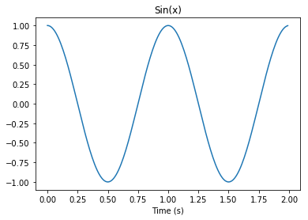
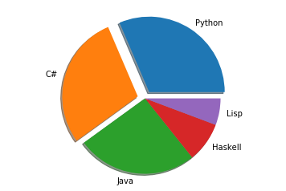

# Python Intro Week 2

## The Nim Game
The Nim game is an ancient 2 player turn-based game. We will be progamming a basic implementation of the Nim game. Far from perfect, our program will allow two players to take turns with a basic text interface. Our program will have very limited validation and error handling so we will rely on the players to play fairly and properly.

The game goes like this. The players agree on a set number of piles and in each pile they place an arbitrary number of tokens. They then take turns choosing a pile and taking a number of tokens from each pile. The person to take the last token/tokens is the winner. There is a second game mode in which the player to take the last token loses the game. We will implement both.

This program lends itself well to both a scripting paradigm or an object-oriented paradigm. We will be using the object-oriented approach.


```python
class Nim():
     
    def __init__(self):
        game_mode, piles = self._setup()
        self._mode = game_mode # True is normal, false is misere
        self._piles = piles
        self._turn = 1
        self._winner = False
        
    def __repr__(self):
        # Comparison operators == (equal to); != (not equal to); 
        # <, <= (less than); >, >= (greater than)
        if self._winner:
            return "Player {} Wins!".format(self._turn)
        else:
            return "Player {}: \n{}".format(self._turn ,self._piles)
        
    def _setup(self):
        game_mode = bool(int(input("Game mode: (1)Normal, (2)Misere \n$ ")) % 2)
        piles = []
        pile = int(input("Input number for pile and 0 to finish\n% "))
        while pile > 0:
            piles.append(pile)
            pile = int(input("% "))
        return (game_mode, piles)
    
    def play(self):
        while not self._winner:
            print(self)
            pile = int(input("Pile: "))
            tokens = int(input("Tokens: "))
            self._piles[pile - 1] -= tokens
            self._end_turn()
        print("Winner: ", self)
            
    def _end_turn(self):
        if sum(self._piles) == 0: # There is a winner
            self._winner = True
            if not self._mode:
                if self._turn == 1:
                    self._turn = 2
                else:
                    self.turn = 1
        else:
            # Nobody has won, next players turn (update _turn)
            if self._turn == 1:
                self._turn = 2
            else:
                self._turn = 1
                

game = Nim()
game.play()
```

## Recursion
Warm up program: Finding the factorial:

Factorial function (!) returns the product of all the positive integers below the value

Outline
```
def factorial(num)
    product = 1
    while num is larger than 0:
        multiply product by num
        subtract one from num
    return product
```


```python
def factorial(num):
    # Write the factorial logic
    product = 1
    while num > 1:
        product *= num
        num -= 1
    return product

print("The factorial of 4 is: ", factorial(4))
```

Recursion is the idea that we can call a function inside itself. Think Inception but with functions. There is nothing stopping us from calling functions within function definitions, and this includes calling the function we are defining.

There are certain programming problems that lend themselves to this approach, for example the Factorial function.


```python
def fact(num):
    # Multipling by 1 does not change our number so we can stop at 2
    if num == 2: 
        return 2
    return (num * fact(num - 1))

print("The factorial of 4 is: ", fact(4))
```


```python
def iter_fib(n): # nth fibonacci number (0 gives the first fibonacci)
    secondLast = 0
    if n == 0:
        return 0
    Last = 1
    for i in range(0,n - 1):
        temp = secondLast + Last
        secondLast = Last
        Last = temp
    return Last

for i in range(0, 10):
    print(iter_fib(i))
```


```python
def fib(n): # nth fibonacci number (0 gives the first fibonacci)
    if n == 0:
        return 0
    elif n == 1:
        return 1
    return fib(n -  1) + fib(n - 2)

for i in range(0, 10):
    print(fib(i))
```

## Towers of Hanoi


```python
def move(source, destination):
    print('Move from Pillar {} to Pillar {}.'.format(source, destination))
    
def towers_of_hanoi(blocks, source = 1, destination = 2, aux = 3):
    if blocks == 1:
        move(source, destination)
    else:
        towers_of_hanoi(blocks - 1, source, aux, destination)
        move(source, destination)
        towers_of_hanoi(blocks - 1, aux, destination, source)
    
towers_of_hanoi(4)
```


```python
# Generate the lucas numbers
def lucas(n):
    if n == 0:
        return 2
    elif n == 1:
        return 1
    return lucas(n - 1) + lucas(n - 2)
                            
# Generate the Catalan numbers
def catalan(n):
    if n == 0:
        return 1
    else:
        coeff = ((4.0 * (n-1) + 2) / ((n-1) + 2))
        return int(coeff * catalan(n - 1))
    
for i in range(0,10):
    print(catalan(i))
```

## Number Guessing Game
Write a program that guesses a secret number. To play the game, you are going to pick a number in your head between two endpoints, 0..100 or 0..1000. The computer will then start to guess your number. You will respond by telling the computer if their is too high, too low, or spot on. When the computer gets the number, the game ends.


```python
print("I am going to guess your number.")
low = 0
high = 1000
print("Pick a number between {} and {}". format(low, high))
print("When I ask, type 'e' for equal, 's' for too small, or 'b' for too big.")

guess = int((high + low) / 2)
result = input("Is {} your number? ".format(guess))

while result != 'e':
    # if the guess was too small
    # update the low variable to reflect the new range
    if result == 's':
        low = guess + 1
    
    # otherwise
    # update the high variable to reflect the new range
    else:
        high = guess - 1
    
    # calculate the new guess
    guess = int((high + low) / 2)
    # ask the user if this new guess is their number
    result = input("Is {} your number? ".format(guess))
```

## Warrior Game
The warrior game uses Object Oriented Programming paradigms to create a basic text-based game where two or more warriors battle to claim victory. We will be defining a class called Warrior which  will model a real life warrior, in particular a waarrior's health and damage dealing capibilities. 

We also need a class that allows us to battle two or more warriors. The Army class will simulate a battle between two teams of Warriors.


```python
import random

class Warrior:
    
    ## Fields: {Name, Health, MaxDamage, MaxBlock, Defeated}
    def __init__(self, name, health, maxDamage, maxBlock):
        self.name = name
        self._health = health
        self._maxDamage = maxDamage
        self._maxBlock = maxBlock
        self._defeated = False
        
    ## Methods: {Attack, Defend, is_defeated}
    def attack(self, warrior):
        damage = random.randint(1, self._maxDamage)
    
        ## All the attacking logic is done in the defender's Defend method
        if not warrior._defeated:
            print("{} attacked {} with {} damage!"\
                  .format(self.name, warrior.name, damage))
            if (warrior.defend(damage) == True): 
                self._maxDamage += 1
                print("{} has defeated his enemy, gained 1 max damage."\
                      .format(self.name))
    
    def defend(self, damage):
        block = random.randint(2, self._maxBlock) 
        if damage > block: ## If we can't block all the damage
            self._health -= damage - block # Take damage
            print("{} took {} damage, (blocked {} damage)"\
                  .format(self.name, damage - block, block))
            if self._health <= 0: # If we have no health
                self._defeated = True  # We have been defeated
                print("{} has been defeated!".format(self.name))
            else:
                print("{} has {} health left."\
                      .format(self.name, self._health))
        else:
            print("{} blocked all {}".format(self.name, damage))
        return self._defeated
    
    def is_defeated(self):
        return self._defeated
    
class Army:
    ## Fields: {id, List of Warriors, defeated}
    def __init__(self,num, warriors):
        self.id = num
        self.warriors = warriors
        self.defeated()
        
    def get_alive(self):
        alive = []
        for warrior in self.warriors:
            if not warrior.is_defeated():
                alive.append(warrior)
        return alive
        
    ## Methods: {Attack a different army, defeated()}
    def defeated(self):
        defeated = True
        for warrior in self.warriors:
            defeated = (defeated and warrior.is_defeated())
        self._defeated = defeated
        return defeated
    
    def attack(self, army):
        for warrior in self.get_alive():
            alive = army.get_alive()
            num_enemy = len(alive)
            if num_enemy > 0:
                enemy = random.randint(0, num_enemy - 1)
                warrior.attack(alive[enemy])
        if army.defeated():
            print("Army {} defeated army {}.".format(self.id, army.id))
            return True
        return False

Kirthi = Warrior("Kirthi", 15, 15, 15)
Eugene = Warrior("Eugene", 10, 30, 5)
Naveen = Warrior("Naveen", 40, 10, 20)
Harrison = Warrior("Harrison", 15, 15, 15)
Angel = Warrior("Angel", 10, 30, 5)
Param = Warrior("Param", 40, 10, 20)
army1 = Army(1, [Kirthi, Eugene, Naveen])
army2 = Army(2, [Harrison, Angel, Param])

while not army1.defeated() and not army2.defeated():
    army1.attack(army2)
    army2.attack(army1)
    
print("")
    
Mitch = Warrior("Mitch", 20,20,20)
Misiel = Warrior("Misiel", 20, 20, 20)
army3 = Army(3, [Mitch])
army4 = Army(4, [Misiel])
while not army3.defeated() and not army4.defeated():
    army3.attack(army4)
    army4.attack(army3)
```

## Exploring Libraries
### Matplotlib & Numpy
Matplotlib is a math plotting library. If we need plot a big selection of data, matplotlib is a great way to do it.


```python
import matplotlib
import matplotlib.pyplot as plt
import numpy as np
%matplotlib inline

x = np.arange(0.0, 2.0, 0.01)
y = np.cos(2 * np.pi * x)

fig, ax = plt.subplots()
ax.plot(x, y)

ax.set(xlabel="Time (s)", Title="Sin(x)")

plt.show()
```





```python
## Using imports from above
labels = 'Python', 'C#', 'Java', 'Haskell', 'Lisp'
values = [55, 50, 45, 15, 10]

fig, ax = plt.subplots()
explode = (0.1, 0.1, 0.0, 0.0, 0.0)

ax.pie(values, explode=explode, labels=labels, shadow=True)
ax.axis('equal')

plt.show()
```





```python
## Using imports from above
a = 5
theta = np.arange(0.0, 4* a, 0.01)
r = 4*np.sin(a*theta)

polar_ax = plt.subplot(111, projection='polar')
polar_ax.set_rticks([])
polar_ax.plot(theta, r)

plt.show()
```


## Requests & Json
The Requests library allow us to make requests of web APIs and more generally, make any http request. A commun use of the requests library is to import data into our programs. In this program we will be importing the weather data for a given zipcode. We will be using OpenWeatherMap.org's API and the requests library to get this weather data.

Then we will read and manipulate the data using the Json library. The http request will yeild an http response with an status code, header, and json text file. We can use the loads (load string) function from the Json library to parse the responce into a dictionary that we can manipulate with python!


```python
## Requests
import requests
import json
from sense_hat import SenseHat

api_key = "27d416217cde265aec0256b4d48c1bdc"
zipcode = "91360"
url = "http://api.openweathermap.org/data/2.5/weather?zip={}&APPID={}"
    .format(zipcode ,api_key)

r = requests.get(url)
print(r.status_code)
```

    200


```python
def kelvin_to_fahr(temp):
    return 9/5 * (temp - 273) + 32

def celcius_to_fahr(temp):
    return 9/5 * (temp) + 32

data = json.loads(r.text)
if 'main' in data and 'temp' in data['main'] and 'name' in data:
    town = data['name']
    temp = data['main']['temp']
    temp = kelvin_to_fahr(temp)
    print("The temperature in {} today is {}".format(town, temp))
       
if temp > 70 and temp < 87:
    print("It is going to be a nice day.")
        
hat = SenseHat()
pi_temp = hat.get_temperature_from_pressure()
print("The pi hat says the temp is {}".format(celcius_to_fahr(pi_temp)))
```

    The temperature in Thousand Oaks today is 78.44000000000003
    It is going to be a nice day.
    The pi hat says the temp is 110.50624771118164

